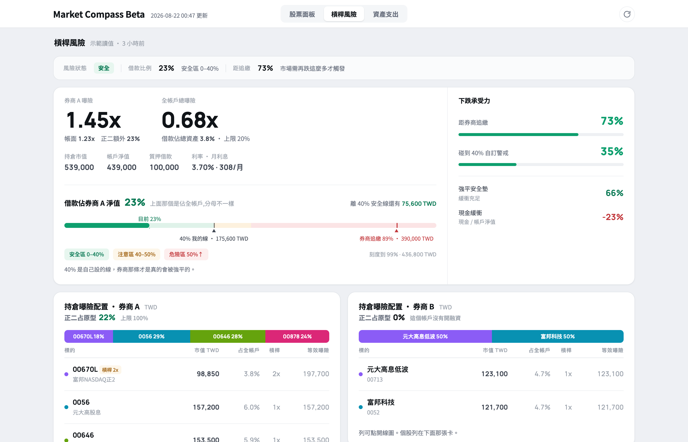

# Market Compass Beta

A personal investing dashboard in one HTML file. Open it and you see four things: which of your holdings just dropped below a moving average, how much you borrowed and how far the market can fall before the broker sells you out, where your money actually sits, and what you spent this month.

**Live demo:** https://chouhsuan1202.github.io/market-compass/

This is the public copy, so it says **Beta** in the title bar. Every number in it is made up: the holdings, the share counts, the cash, the mortgage, the transactions. No real account, no real position, no real trade.

The sample data is a Taiwan office worker in New Taiwan dollars: a salary, a mortgage, a few dividend ETFs and eight local stocks. Swap in your own numbers and currency and it follows.

## Run it

Download the folder and open `index.html`. That is the whole setup. No build step, no server, no account, no database.

On a phone, add it to the home screen and it runs full screen like an app.

## The tabs

| Tab | The question it answers |
|---|---|
| Stocks | Which tickers just fell below the 5, 20, 60, 120 or 240 day average, so I can add |
| Leverage | How much did I borrow, and how far can the market drop before I get liquidated |
| Assets | How much do I have, split into ETFs, single stocks and everything else |
| Spending | Where did the money go this month, and did I go over my baseline |

On a wide screen Assets and Spending share one page, with Spending shown first.

## Use your own numbers

Edit these files and the screen follows. Nothing else to change.

| File | What goes in it |
|---|---|
| `asset-portfolio.json` | Which tickers you hold in which account, and how many shares |
| `asset-balances.json` | Bank cash, property, mortgage. Anything without a market price |
| `asset-milestones.json` | Historical net worth points, for the long term chart |
| `leverage-data.js` | A snapshot of your broker account: equity, loan, maintenance margin |
| `expense-data.js` | Every transaction for the month |
| `watchlist.json` | Which tickers to track |

`data.json` holds prices and moving averages. Refresh it daily with your own script and a quote API. This repo ships a trimmed sample so the charts have something to draw.

`asset-data.js` is computed. Do not hand edit it.

## Ideas behind it

**It describes, it does not predict.** The dashboard never says "buy now". It says "this fell below the 60 day line". What you do about that is your call.

**Two separate risk lines.** Liquidation risk only counts collateral inside the broker account, because money sitting elsewhere takes days to move and will not save you. The total borrowing cap is measured against everything you own.

**Phone and desktop are two different layouts,** not one shrunk down. On a phone you want fewer things on screen, not the same things smaller.

## License

MIT. Fork it, change it, make it yours.
